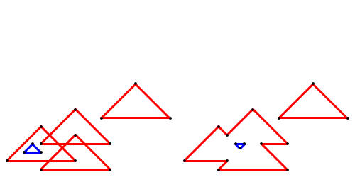

# polygons - example of using the zappem.net/pub/math/polygon package

## Overview

This repository provides a small example of using the
[`zappem.net/pub/math/polygon`](https://pkg.go.dev/zappem.net/pub/math/polygon)
package.

The example program creates a space containing 5 overlapping triangles
(one of which is considered a "hole"), and then computes the outline
of the overlapping polygon. You can run the included example as follows:

```
$ go run polygons.go
2024/05/05 18:35:27 wrote result to "dump.png"
```

The result shows the pre-outlined polygons on the left, and the
post-outlined polygons on the right:



## License info

The `polygons` example program is distributed with the same BSD
3-clause license as that used by [golang](https://golang.org/LICENSE)
itself.

## Reporting bugs

Use the [github `polygons` bug
tracker](https://github.com/tinkerator/polygons/issues).
