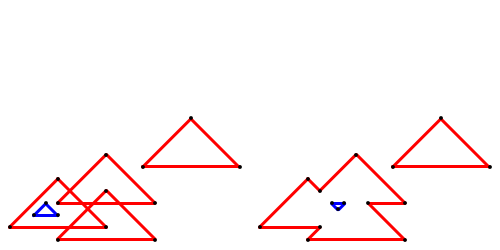
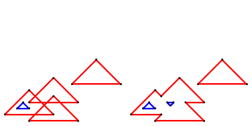

# polygons - example of using the zappem.net/pub/math/polygon package

## Overview

This repository provides a small example of using the
[`zappem.net/pub/math/polygon`](https://zappem.net/pub/math/polygon)
package.

The [example](https://zappem.net/pub/project/polygons) program creates
a space containing 5 overlapping triangles (one of which is considered
a "hole"), and then computes the outline of these overlapping
polygons. You can run the included example as follows:

```
$ go run polygons.go
2024/05/05 18:35:27 wrote result to "dump.png"
```

The result shows the pre-outlined polygons on the left, and the
post-outlined polygons on the right:



Note, the hole (blue triangle) on the left, does not survive the Union
merging, because it is overwritten by a triangle that envelops it. On
the other hand, the gap between the three partially overlapping
triangles on the left emerges as a hole within the red polygon outline
after the Union operation.

The `polygons.go` example can preserve fully internal holes, using the
`--swallow=false` flag. This operation extracts holes before merging
the shapes and then adds them back after generating the union of what
remains:

```
$ go run polygons.go --swallow=false
2026/08/30 07:55:27 wrote result to "dump.png"
```

To yield this:



The program can also save the result in `.polys` format, which is just
a JSON represention of the `polygons.Shapes` structure. That can be
used with the
[`svgpoly/examples.go`](https://zappem.net/pub/graphics/svgpoly/) tool
to generate SVG output. If `../svgpoly` is where your clone of that
repo is, you can do this to generate an SVG:

```
$ go run polygons.go --swallow=false --dest=dump.polys
2026/08/30 08:31:19 wrote result to "dump.polys"
$ cd ../svgpoly
$ go run examples/outline.go --after=false --before --hatch .1 --hatch-angle 20 --poly ../polygons/dump.polys --osvg dump.svg
```

Which generates this SVG image:


## License info

The `polygons` example program is distributed with the same BSD
3-clause license as that used by [golang](https://golang.org/LICENSE)
itself.

## Reporting bugs

Use the [github `polygons` bug
tracker](https://github.com/tinkerator/polygons/issues).
